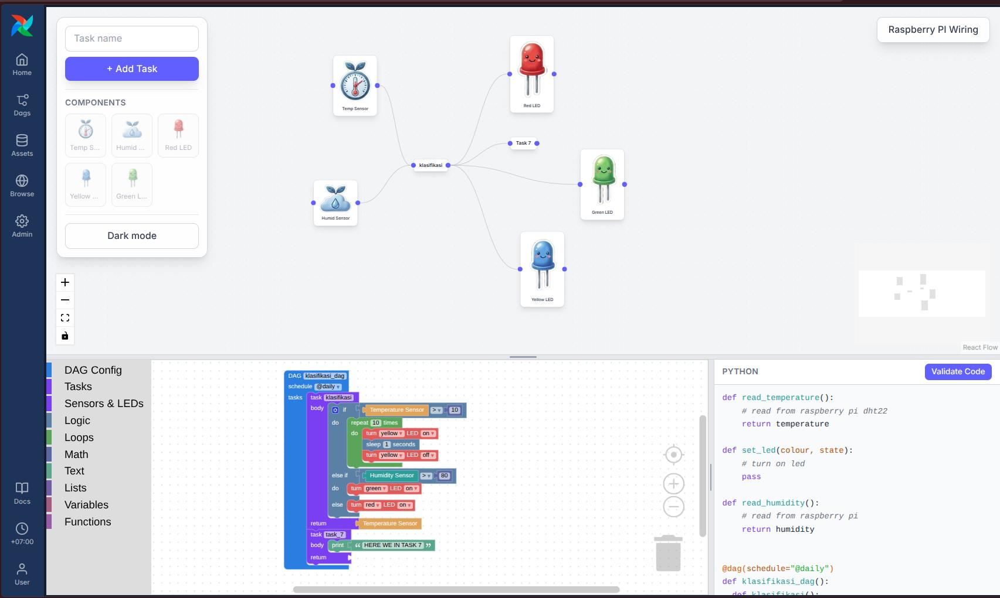

# PaperFlow



An educational project teaching kids workflow orchestration with Apache Airflow
and a Raspberry Pi.

**Needs:** Node 20+, Python 3.12+, and [uv](https://docs.astral.sh/uv/).

**Config:** one root `.env` for everything — `cp .env.example .env`. `api/` and
the builder UI load it automatically; export it before Airflow (`set -a;
source .env; set +a`).

---

## Airflow + Builder UI — `airflow/`

```bash
cd airflow
uv sync

export AIRFLOW_HOME="$PWD"
uv run airflow db migrate
uv run airflow standalone    # http://localhost:8080
```

`airflow standalone` prints the admin password on first start.

The visual builder is served by the PaperFlow plugin at
**http://localhost:8080/paperflow/**. Its bundle has to be built first:

```bash
cd airflow/plugins/paperflow/ui
npm install
npm run build
```

For UI development, `npm run dev` serves the builder standalone at
http://localhost:5173.

## IoT API — `api/`

Bridges the Pi's MQTT telemetry into HTTP/SSE and publishes LED commands back.

```bash
cd api
python3 -m venv .venv && source .venv/bin/activate
pip install -r requirements.txt
python main.py               # http://localhost:8000/docs
```

## Raspberry Pi — `mqtt/`

`mqtt/raspi.py` runs on the Pi. It reads the DHT22 every 5s and publishes to
`paperflow/sensor`, publishes button presses to `paperflow/sensor/buttons`, and
drives the LEDs from `paperflow/actuator/{color}`.

Pins (BCM numbering):

| Component | Pin | Notes |
|-----------|-----|-------|
| DHT22 sensor (data) | GPIO 5 (`board.D5`) | temperature + humidity |
| Red LED | GPIO 27 | |
| Yellow LED | GPIO 22 | |
| Green LED | GPIO 17 | |
| Push button | GPIO 19 | internal pull-up |

```bash
pip install -r requirements.txt    # from the repo root (Pi + API deps)
python mqtt/raspi.py
```

---

See `AGENTS.md` for architecture and `PLAN.md` for the roadmap.
